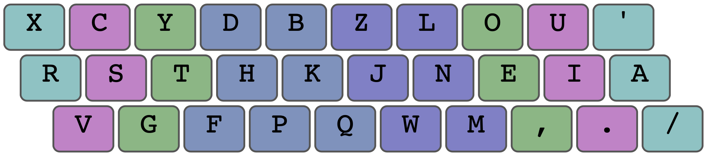
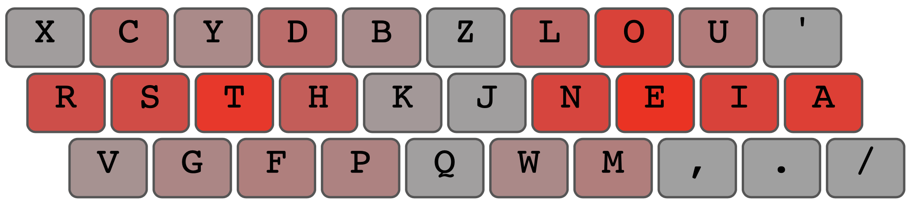

# Overview

APTHD is a layout optimized for a standard row-stagger keyboard.

```
x c y d b z l o u '
 r s t h k j n e i a
  v g f p q w m , . /
```

## Fingermap

The fingermap takes advantage of Angle Mod, such that the lower left corner of the keyboard is matched with the left hand fingers as follows:



This makes it more comfortable to press those bottom row keys vs a strict traditional fingering.

In addition, APTHD takes advantage of the unique nature of the lower index clusters, since these groups of 3 keys are very easy to reach on a rowstag board.

These clusters are:

```
 h    n
f p  w m
```

## Heatmap



The heatmap highlights several important aspects of this layout:

- Pinky corners are low usage
- Ring fingers are moderate usage
- Reaching into the inner index keys is minimal, since 4 letters there are in the bottom 5 by usage (ZQJK)
- The highest use letters (ET) are on the middle finger home spot
